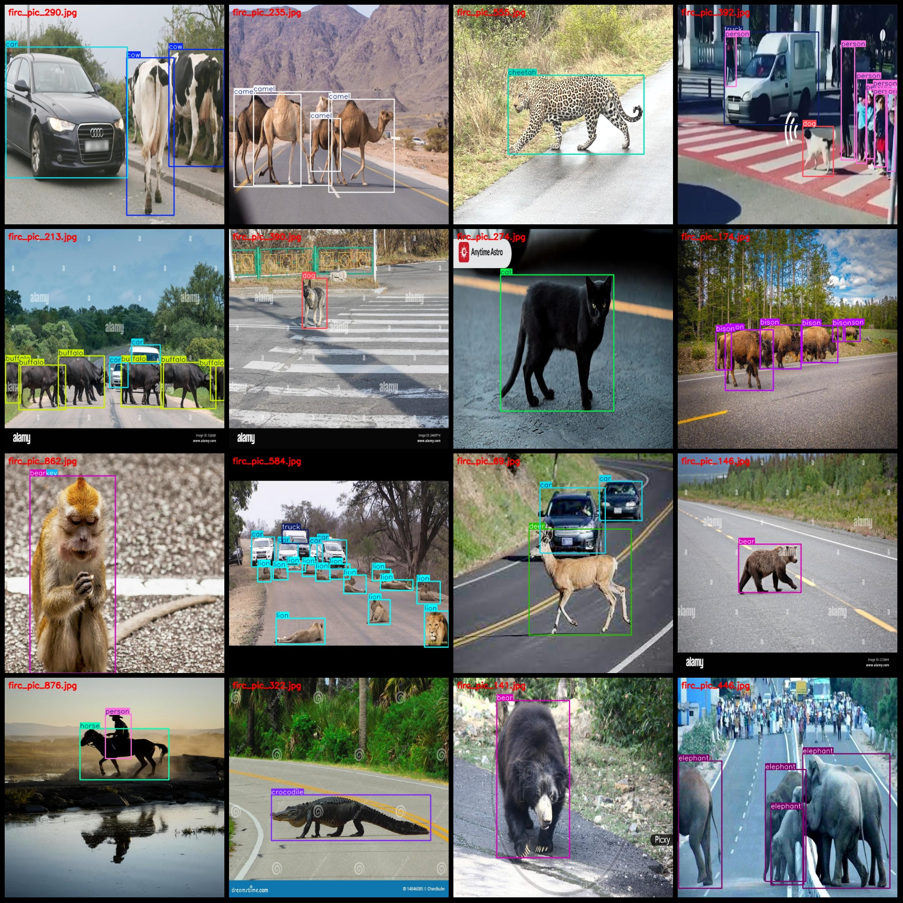
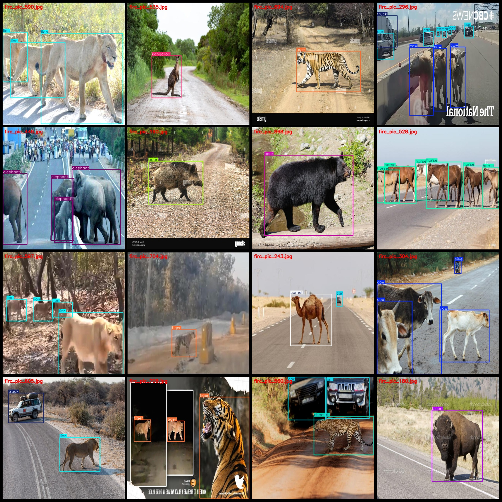

# Road Animal Crossing Detection Dataset (VOC+YOLO) Format, 895 Images in 52 Categories

Dataset format: Pascal VOC format+YOLO format (without split path in txtfile, only include jpgimage and corresponding VOC format xmlfile and yolo format txtfile)

number of images: 895 images
Annotation count: 895
Annotation count: 895
Annotation count: 52
annotation class names: ["Hyena","auto","bear","bicycle","bike","bison","boar","buffalo","bus","camel","capybara","car","cat","cheetah","cow","crocodile","deer","dog","duck","elephant","fox","giraffe","goat","hen","horse","kangaroo","koala","leopard","lion","mongoose","monkey","moon","moose","motorcycle","objects","ostrich","person","pig","porcupine","rabbit","racoon","reindeer","sheep","snail","tiger","tortoise","tricycle","truck","van","wildebeest","wolf","zebra"]
boxes per class: 
- Hyena: 2
- auto: 1
- bear: 88
- bicycle: 1
- bike: 19
- bison: 186
- boar: 33
- buffalo: 63
- bus: 11
- camel: 68
- capybara: 1
- car: 663
- cat: 47
- cheetah: 28
- cow: 226
- crocodile: 20
- deer: 230
- dog: 78
- duck: 3
- elephant: 121
- fox: 39
- giraffe: 16
- goat: 170
- hen: 3
- horse: 43
- kangaroo: 27
- koala: 3
- leopard: 2
- lion: 117
- mongoose: 1
- monkey: 47
- moon: 1
- moose: 32
- motorcycle: 1
- objects: 1
- ostriches: 3
- person: 215
- pig: 2
- porcupine: 1
- Rabbits: 11 pictures
- Racoons: 1 picture
- Reindeer: 20 pictures
- Sheep: 43 pictures
- Snails: 1 picture
- Tigers: 46 pictures
- Tortoises: 3 pictures
- Tricycles: 3 pictures
- Trucks: 74 pictures
- Vans: 3 pictures
- Wildebeest: 1 picture
- Wolves: 23 pictures
- Zebras: 9 pictures
Total frames: 2851 frames
Each category has a total of:
- Hyena: 2
- auto: 1
- bear: 52
- bicycle: 1
- bike: 15
- bison: 57
- boar: 15
- buffalo: 20
- bus: 11
- camel: 29
- capybara: 1
- car: 265
- cat: 29
- cheetah: 26
- cow: 58
- crocodile: 20 images
- deer: 126 images
- dog: 62 images
- duck: 1 images
- elephant: 56 images
- fox: 38 images
- giraffe: 7 images
- goat: 30 images
- hen: 2 images
- horse: 24 images
- kangaroo: 10 images
- koala: 2 images
- leopard: 2 images
- lion: 49 images
- mongoose: 1 images
monkey: 18
moon: 1
moose: 27
motorcycle: 1
objects: 1
ostriches: 1
persons: 111
pigs: 1
porcupines: 1
rabbits: 11
raccoons: 1
reindeer: 18
sheep: 11
snails: 1
tigers: 42
- Tortoise: 3 images
- Tricycle: 3 images
- Truck: 64 images
- Van: 3 images
- Wildebeest: 1 image
- Wolf: 17 images
- Zebra: 5 images
image resolution: 640x640
## Images

Here is a pay link on Stripe ( https://buy.stripe.com/3cs8yP7sY87d0vu9AB ). Please contact me lonlonago@foxmail.com after funding $89, and I will send you a complete data files , thank you!

